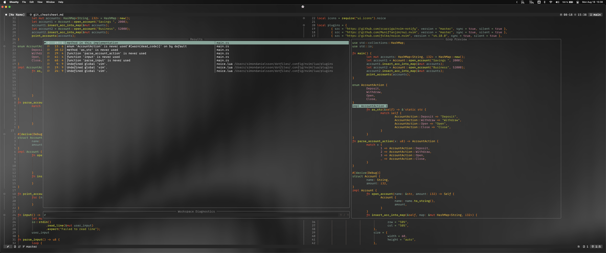
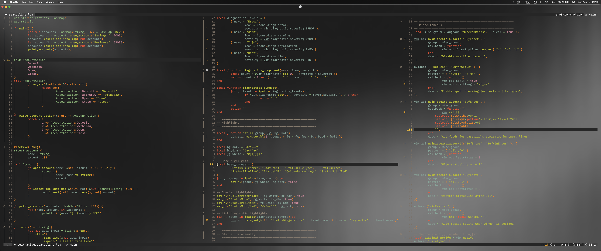

# 🇸🇪 A Swedish Development Environment
This repository contains my personal dotfiles for a minimal and maintainable development environment tailored for Rust and Python, as well as GDScript. My focus is on leveraging the native features of Neovim and TMUX before resorting to plugins, ensuring a relatively lightweight setup.
What makes this config unique is its Swedish flair—optimized for Swedish keyboard layouts (e.g., easy access to å, ä, ö in keymaps). But note that I'm using my own modified version of the Workman keyboard layout on a 42-key split keyboard, so my keymaps may not make sense for someone with a qwerty US-layout.

> ⚠️ This is **not** intended to be installed as a complete config - instead, I recommend that you sift through these files and take inspiration; copy-paste what you like into your own setup.

## 📸 Screenshots

## 🖥️ TMUX `.tmux.conf`
- ⌨️ Prefix: `Ctrl-a`
- 🖱️ Mouse support for when you're feeling treacherous.
- 📊 Status bar: session name, time, load average.

## 🐚 Zsh `.zshrc`
Zsh is my shell of choice. I've set it up so that a new zsh instance will automatically attach to a TMUX session called `main` - if there is none already running, a new `main` TMUX session will be created. This ensures I am always inside TMUX when I start my terminal emulator.

### Zsh Aliases `zsh_aliases.zsh`
- 🐍 **`p`**: `python3 *.py`
- 🦀 **`r`**: `cargo run --release`
- 🦀 **`rd`**: `cargo doc --open`
- 🕹️ **`gd`**: Launches a script that starts Godot and Neovim ( through `gv` ) together.
- 🚀 **`gv`**: Launches a script that starts Neovim piped to a local Godot LSP server.
- 📔 **`journal`**: Starts Neovim with a new Typst file using a template - this is automatically titled to the current date and saved in `~/journal`. This makes for effortless journaling, so that I can focus on writing down my thoughts without friction.
- 💀 **`q`**: Launches a script that kills all Neovim and TMUX sessions.
- 📂 **`ls`**: `eza --color=always --icons --group-directories-first --git --no-time --no-permissions`
- 🔍 **`ss`**: Launches fzf with preview window - built-in logic so that if a *directory* is selected you cd into it, but if a *file* is selected you open it in Neovim. Searches from the global directory regardless of `cwd`.
- 🔍 **`s`**: The same logic as `ss`, but only searches through the current directory.

## 📝 Neovim `.config/nvim/`
Using **v0.12 nightly** with Lua modules for modularity and `vim.pack` as the plugin manager.

### Core Init `init.lua`
- ⚙️ Loads native settings, UI, plugins, LSP.
- 📌 Dynamically renames TMUX windows based on buffer.
- 🎨 Switch from standard theme to `pink_explosion` theme with a true/false variable.
- 🌗 Toggle background transparency with a true/false variable.

### Native `lua/native/`
- 🚀 **autocmds.lua**: Loads and loads of autocommands.
- 📝 **comment.lua**: Native commenting logic.
- ⌨️ **keymaps.lua**: Keymaps.
- 📁 **netrw.lua**: Built-in file explorer customization.
- 🛠️ **options.lua**: Global options.

### Plugins `lua/plugins/`
- 🕹️ [**nvim-cmp**](https://dotfyle.com/plugins/hrsh7th/nvim-cmp)
- ✨ [**flash.nvim**](https://dotfyle.com/plugins/folke/flash.nvim)
- 📏 [**indent-blankline.nvim**](https://dotfyle.com/plugins/lukas-reineke/indent-blankline.nvim)
- 💬 [**noice.nvim**](https://dotfyle.com/plugins/folke/noice.nvim)
- 🔭 [**telescope.nvim**](https://dotfyle.com/plugins/nvim-telescope/telescope.nvim)
- 🖥️ [**nvim-lspconfig**](https://dotfyle.com/plugins/neovim/nvim-lspconfig)
- 🌳 [**nvim-treesitter**](https://dotfyle.com/plugins/nvim-treesitter/nvim-treesitter)
- 🔗 [**mini.surround**](https://dotfyle.com/plugins/echasnovski/mini.surround)
- ⏪ [**undotree**](https://github.com/mbbill/undotree)
- 🧰 [**mason.nvim**](https://dotfyle.com/plugins/williamboman/mason.nvim)
- 🔧 [**plenary.nvim**](https://dotfyle.com/plugins/nvim-lua/plenary.nvim)
- 🎨 [**nui.nvim**](https://dotfyle.com/plugins/MunifTanjim/nui.nvim)
- 🔔 [**nvim-notify**](https://dotfyle.com/plugins/rcarriga/nvim-notify)
- 📁 [**netrw.nvim**](https://dotfyle.com/plugins/prichrd/netrw.nvim)
- 🌟 [**nvim-web-devicons**](https://dotfyle.com/plugins/nvim-tree/nvim-web-devicons)
- 📚 [**friendly-snippets**](https://dotfyle.com/plugins/rafamadriz/friendly-snippets)
- ✂️ [**LuaSnip**](https://dotfyle.com/plugins/L3MON4D3/LuaSnip)
- 🗝️ **keymaps.lua**

### UI `lua/ui/`
- 🎨 **theme.lua**: Defines custom color palette - configuring these colours allow you to change the colour style globally across Neovim.
- 🖌️ **colorscheme.lua**: Applies color overrides using the colors set in `colors.lua`, using the built-in theme `retrobox` as a foundation.
- 🌟 **icons.lua**: Defines icons for statusline, telescope, etc., using Nerd Fonts.
- 📊 **statusline.lua**: Custom statusline displaying mode, file name, diagnostics, git branch, wordcount etc.

### Templates `templates/`
Template files for new buffers ( defined in `autocmds.lua` ).
- 🐚 C
- 🔵 C++
- 🟨 Javascript
- 🌙 Lua
- 🐍 Python
- 🦀 Rust
- 🖋️ Typst

## Scripts `scripts/`
Utility bash scripts:
- 💀 **kill-nvim-and-tmux.sh**: Kills all Neovim and TMUX processes.
- 🚀 **start-godot-and-nvim-together.sh**: Opens Godot together with Neovim.
- 🔧 **start-nvim-with-godotpipe.sh**: Starts Neovim with GodotPipe for editing GDScript with Godot.
