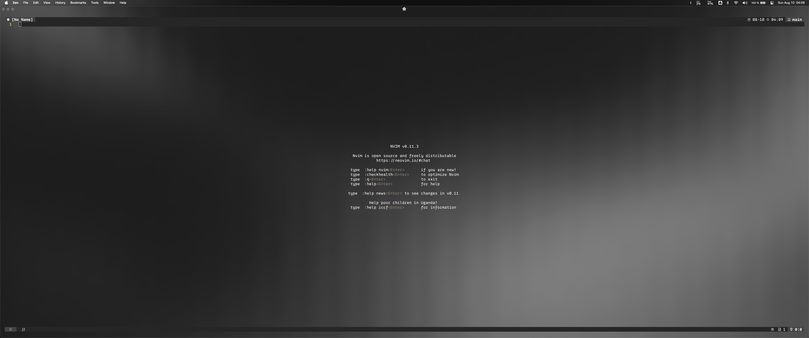

# The ultimate swedish development environment

This **TMUX/Neovim config** was set up with **Rust** and **Python** development in mind, although I also play around with some **GDScript**, **Javascript** and **CSS** once in a while. My goal with this config was to create a minimalist and maintainable development environment - to achieve this, I put focus on using the native features of Neovim as much as possible, only resorting to plugins wherever I felt something was missing.
> Note that this is **not** intended to be installed as a complete config - instead, I recommend that you sift through these files and take inspiration. Feel free to copy/paste into your own config as you see fit!

### Terminal Emulator
+ [Ghostty](https://ghostty.org)

### Shell
+ Zsh ([Oh-My-Zsh](https://ohmyz.sh/))

### Neovim plugins
+ [hrsh7th/nvim-cmp](https://dotfyle.com/plugins/hrsh7th/nvim-cmp)
+ [stevearc/oil.nvim](https://dotfyle.com/plugins/stevearc/oil.nvim)
+ [nvim-telescope/telescope.nvim](https://dotfyle.com/plugins/nvim-telescope/telescope.nvim)
+ [ThePrimeagen/vim-be-good](https://dotfyle.com/plugins/ThePrimeagen/vim-be-good)
+ [kdheepak/lazygit.nvim](https://dotfyle.com/plugins/kdheepak/lazygit.nvim)
+ [lukas-reineke/indent-blankline.nvim](https://dotfyle.com/plugins/lukas-reineke/indent-blankline.nvim)
+ [neovim/nvim-lspconfig](https://dotfyle.com/plugins/neovim/nvim-lspconfig)
+ [williamboman/mason.nvim](https://dotfyle.com/plugins/williamboman/mason.nvim)
+ [folke/flash.nvim](https://dotfyle.com/plugins/folke/flash.nvim)
+ [MunifTanjim/nui.nvim](https://dotfyle.com/plugins/MunifTanjim/nui.nvim)
+ [nvim-lua/plenary.nvim](https://dotfyle.com/plugins/nvim-lua/plenary.nvim)
+ [folke/lazy.nvim](https://dotfyle.com/plugins/folke/lazy.nvim)
+ [nvim-treesitter/nvim-treesitter](https://dotfyle.com/plugins/nvim-treesitter/nvim-treesitter)
+ [rcarriga/nvim-notify](https://dotfyle.com/plugins/rcarriga/nvim-notify)
+ [folke/noice.nvim](https://dotfyle.com/plugins/folke/noice.nvim)
