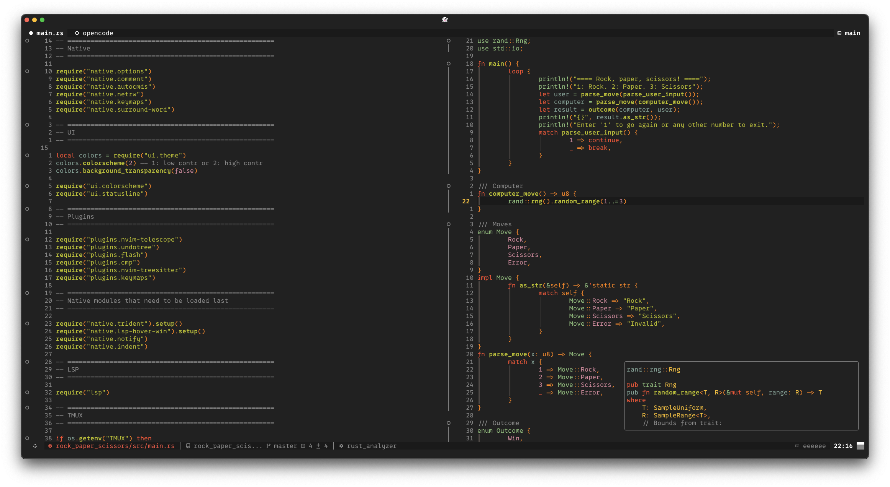

  

**SIMVIM** is my personal development environment tailored for Rust and Python, as well as GDScript. My focus lies on leveraging the native features of Neovim and TMUX before resorting to plugins, ensuring a relatively lightweight setup.
Note that I'm using my own modified version of Workman on a 42-key split keyboard, so my keymaps may not make sense for someone with (for example) a qwerty US-layout.

> ⚠️ This is **not** intended to be installed as a complete config - instead, I recommend that you sift through these files and take inspiration; copy-paste what you like into your own setup.

## 📸 Screenshots

## 🖥️ TMUX `.tmux.conf`
- ⌨️ Prefix: `Ctrl-a`
- 🖱️ Mouse support for when you're feeling treacherous.
- 📊 Status bar: session name, time, load average.

## 🐚 Zsh `.zshrc`
Zsh is my shell of choice. I've set it up so that a new zsh instance will automatically attach to a TMUX session called `main` - if there is none already running, a new `main` TMUX session will be created. This ensures I am always inside TMUX when I start my terminal emulator.

### Zsh Aliases `zsh_aliases.zsh`
- 🐍 **`p`**: `python3 *.py`
- 🦀 **`r`**: `cargo run --release`
- 🦀 **`rd`**: `cargo doc --open`
- 🕹️ **`gd`**: Launches a script that starts Godot and Neovim ( through `gv` ) together.
- 🚀 **`gv`**: Launches a script that starts Neovim piped to a local Godot LSP server.
- 📔 **`journal`**: Starts Neovim with a new Typst file using a template - this is automatically titled to the current date and saved in `~/journal`. This makes for effortless journaling, so that I can focus on writing down my thoughts without friction.
- 💀 **`q`**: Launches a script that kills all Neovim and TMUX sessions.
- 📂 **`ls`**: `eza --color=always --icons --group-directories-first --git --no-time --no-permissions`
- 🔍 **`ss`**: Launches fzf with preview window - built-in logic so that if a *directory* is selected you cd into it, but if a *file* is selected you open it in Neovim. Searches from the global directory regardless of `cwd`.
- 🔍 **`s`**: The same logic as `ss`, but only searches through the current directory.

### Scripts `scripts/`
- 💀 **kill-nvim-and-tmux.sh**: Kills all Neovim and TMUX processes.
- 🚀 **start-godot-and-nvim-together.sh**: Opens Godot together with Neovim.
- 🔧 **start-nvim-with-godotpipe.sh**: Starts Neovim with GodotPipe for editing GDScript with Godot.

## 📝 Neovim `.config/nvim/`
Using **v0.12 nightly** with Lua modules for modularity and `vim.pack` as the plugin manager.

### Core Init `init.lua`
- ⚙️ Sets the load-order of native settings, UI, plugins and LSP.
- 📌 Dynamically renames TMUX windows based on buffer.
- 🎨 Switch between the colorschemes defined in **ui/theme.lua** using a numbering system.
- 🌗 Toggle background transparency with a true/false variable.

### Native `lua/native/`

- 🔱 **trident.lua**: A Neovim-native interpretation of [harpoon](https://github.com/ThePrimeagen/harpoon/tree/harpoon2).
    - Buffers can not be added manually like in harpoon, but are instead added and subtracted from the list automatically.
    - A maximum of 6 buffers are allowed on the list at once (to minimize visual noise) - this is easily configurable if you find it limiting.
    - The list automatically rotates sequentially when any listed buffers are closed or deleted.
    - Uses **nvim-web-devicons** to get filetype icons in the list - if **nvim-web-devicons** is malfunctioning or isn't installed, Trident defaults to a configurable fallback icon to avoid errors.
    - Hit the prefix `"` to initiate Trident, then hit the number corresponding to the buffer you wish to open. The prefix is easily altered within **trident.lua**.

- 🔍 **vim_hover_win.lua**: A Neovim-native LSP hover window.
    - Quick reference at cursor hover.
    - Configurable max window size and width.
    - No toggle, always on. To turn it off, do so manually in **init.lua**.

- 🚀 **autocmds.lua**: Loads and loads of autocommands.
- 📝 **comment.lua**: Native commenting logic.
- ⌨️ **keymaps.lua**: Keymaps.
- 📁 **netrw.lua**: Built-in file explorer customization.
- 🛠️ **options.lua**: Global options.

### Plugins `lua/plugins/`
- 🕹️ [**nvim-cmp**](https://dotfyle.com/plugins/hrsh7th/nvim-cmp)
- ✨ [**flash.nvim**](https://dotfyle.com/plugins/folke/flash.nvim)
- 📏 [**indent-blankline.nvim**](https://dotfyle.com/plugins/lukas-reineke/indent-blankline.nvim)
- 💬 [**noice.nvim**](https://dotfyle.com/plugins/folke/noice.nvim)
- 🔭 [**telescope.nvim**](https://dotfyle.com/plugins/nvim-telescope/telescope.nvim)
- 🖥️ [**nvim-lspconfig**](https://dotfyle.com/plugins/neovim/nvim-lspconfig)
- 🌳 [**nvim-treesitter**](https://dotfyle.com/plugins/nvim-treesitter/nvim-treesitter)
- 🔗 [**mini.surround**](https://dotfyle.com/plugins/echasnovski/mini.surround)
- ⏪ [**undotree**](https://github.com/mbbill/undotree)
- 🧰 [**mason.nvim**](https://dotfyle.com/plugins/williamboman/mason.nvim)
- 🔧 [**plenary.nvim**](https://dotfyle.com/plugins/nvim-lua/plenary.nvim)
- 🎨 [**nui.nvim**](https://dotfyle.com/plugins/MunifTanjim/nui.nvim)
- 🔔 [**nvim-notify**](https://dotfyle.com/plugins/rcarriga/nvim-notify)
- 📁 [**netrw.nvim**](https://dotfyle.com/plugins/prichrd/netrw.nvim)
- 🌟 [**nvim-web-devicons**](https://dotfyle.com/plugins/nvim-tree/nvim-web-devicons)
- 📚 [**friendly-snippets**](https://dotfyle.com/plugins/rafamadriz/friendly-snippets)
- ✂️ [**LuaSnip**](https://dotfyle.com/plugins/L3MON4D3/LuaSnip)
- 🗝️ **keymaps.lua**

### UI `lua/ui/`
- 🎉 **splash.lua**: A Neovim-native splashscreen.
    - Centered banner configurable in **theme.lua**.
    - Separate highlight groups for version, banner, and buttons - configurable in **theme.lua**.
    - Configurable quick-action buttons.
    - Neovim version display.
- 🎨 **theme.lua**: Defines custom color palette - configuring these colours allow you to change the colour style globally across Neovim.
- 🖌️ **colorscheme.lua**: Applies color overrides using the colors set in **theme.lua**.
- 🌟 **icons.lua**: Defines icons for statusline, telescope, etc., using Nerd Fonts.
- 📊 **statusline.lua**: Custom statusline displaying mode, file name, diagnostics, git branch, wordcount etc.

### Templates `templates/`
Template files for new buffers ( template application is defined in **autocmds.lua** ).
- 🐚 C
- 🔵 C++
- 🟨 Javascript
- 🌙 Lua
- 🐍 Python
- 🦀 Rust
- 🖋️ Typst
